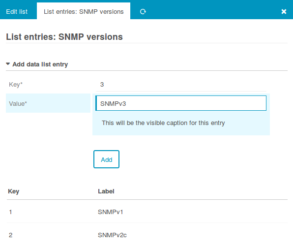

Data Fields example: SNMP
=========================

Ever wondered how to provide an easy to use SNMP configuration to your users?
That's what we're going to show in this example. Once completed, all your Hosts
inheriting a specific (or your "default") Host Template will provide an optional
`SNMP version` field.

In case you choose no version, nothing special will happen. Otherwise, the host
offers additional fields depending on the chosen version. `Community String` for
`SNMPv1` and `SNMPv2c`, and five other fields ranging from `Authentication User`
to `Auth` and `Priv` types and keys for `SNMPv3`.

Your services should now be applied not only based on various Host properties
like `Device Type`, `Application`, `Customer` or similar - but also based on
the fact whether credentials have been given or not.

Prepare required Data Fields
----------------------------

As we already have learned, `Fields` are what allows us to define which custom
variables can or should be defined following which rules. We want SNMP version
to be a drop-down, and that's why we first define a `Data List`, followed by
a `Data Field` using that list:

### Create a new Data List

### Fill the new list with SNMP versions

### Create a corresponding Data Field

Next, please also create the following elements:

* a list *SNMPv3 Auth Types* providing `MD5` and `AES`
* a list *SNMPv3 Priv Types* providing at least `AES` and `DES`
* a `String` type field `snmp_community` labelled *SNMP Community*
* a `String` type field `snmpv3_user` labelled *SNMPv3 User*
* a `String` type field `snmpv3_auth` labelled *SNMPv3 Auth* (authentication key)
* a `String` type field `snmpv3_priv` labelled *SNMPv3 Priv* (encryption key)
* a `Data List` type field `snmpv3_authprot` labelled *SNMPv3 Auth Type*
* a `Data List` type field `snmpv3_privprot` labelled *SNMPv3 Priv Type*

Please do not forget to add meaningful descriptions, telling your users about
in-house best practices.

